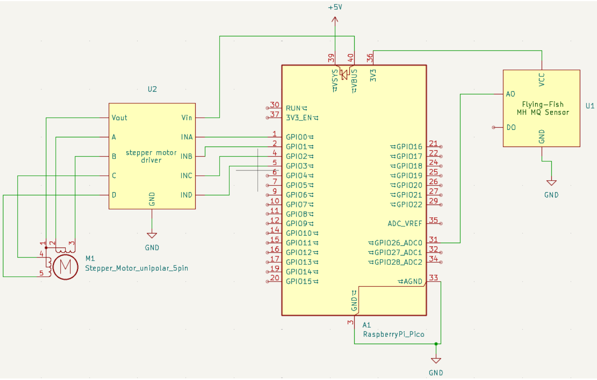

# Gas sensing using MQ2 module and Raspberry pi Pico

This repo is an example of how we can interface Rpi Pico with MQ2 gas sensor module and in response control a stepper motor based on the LPG gas levels

## Circuit Diagram

## Steps to run the Code
1. Start by flashing MicroPython firmware on the Raspberry Pi Pico. This [link](https://randomnerdtutorials.com/raspberry-pi-pico-vs-code-micropython/) can be referenced for convenience.
2. Upload the MicroPython code in this repo to Pico.
3. Run [main.py](./main.py) file.